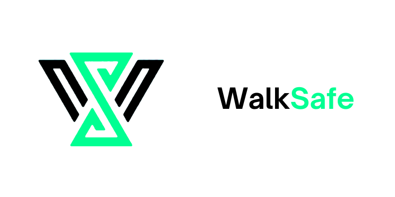
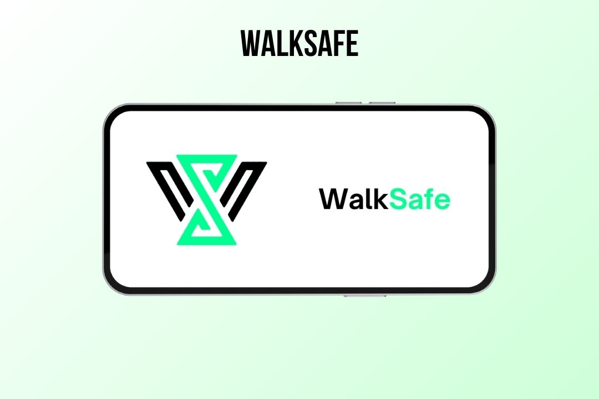
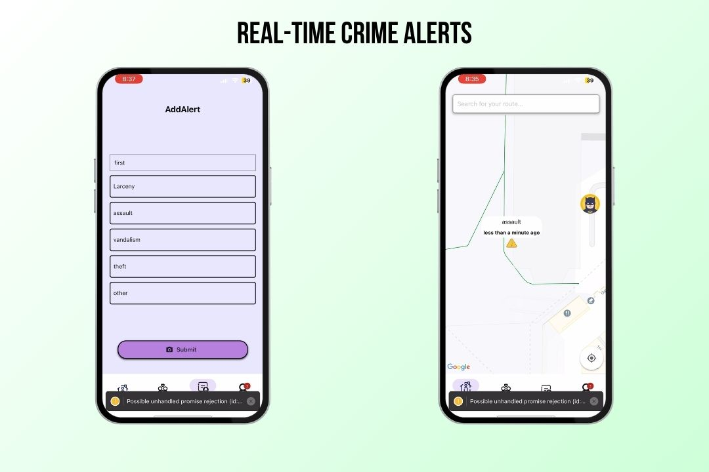
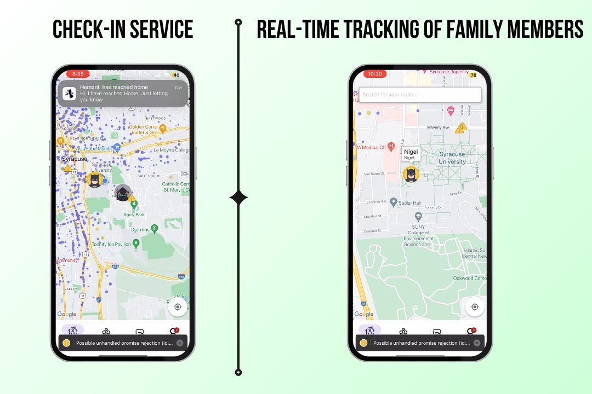
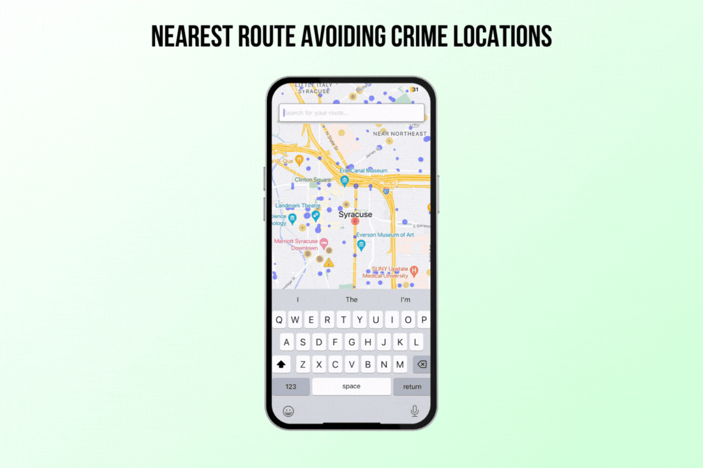

# WalkSafe

 

## App Overview Video

## Inspiration

 
The inspiration behind <b>WalkSafe</b> stems from a deep-seated commitment to leveraging technology for the betterment of society, particularly in ensuring the safety and well-being of individuals and their families. With the world becoming more and more chaotic and fast-paced, a dependable system that smoothly combines safety alerts, route optimization, and real-time tracking is necessary. The concept for <b>WalkSafe</b> was born out of the growing concerns people had about their personal safety and the need for better ways to stay in touch with their loved ones. With cutting-edge technology and a sincere care for people's safety, <b>WalkSafe</b> seeks to equip users with the knowledge and skills necessary to go through everyday life with assurance and comfort. The vision for <b>WalkSafe</b> is to create a safer and more connected world, where individuals can thrive without compromising on their security or sacrificing their peace of mind.

## Project Description

Introducing WalkSafe, your ultimate companion for ensuring the safety of your loved ones while navigating through the city. WalkSafe is a comprehensive mobile application available on both Android and iOS platforms, designed to provide real-time tracking, route optimization, and safety alerts to keep you and your family secure at all times.

**Key Features:**

1. **Real-Time Tracking of Friends and Family Members:**
   Stay connected with your loved ones effortlessly. WalkSafe enables you to track the real-time location of your friends and family members on an interactive map. Whether it's a quick meetup or ensuring everyone's safety during a night out, you can easily keep an eye on their whereabouts.

2. **Nearest Route Avoiding Crime Locations:**
   Safety is our top priority. WalkSafe utilizes advanced algorithms to analyze crime data and suggests the safest routes to your destination. By avoiding high-crime areas, you can travel with peace of mind, knowing that you're taking the most secure path available.

3. **Check-In Service:**
   Never worry about your loved ones reaching home safely again. With WalkSafe's Check-In Service, your family members receive automatic notifications when you reach your designated destination. Whether it's returning from work or a late-night outing, this feature provides reassurance to your loved ones that you've arrived safely.

4. **Real-Time Crime Alerts:**
   Stay informed and vigilant with WalkSafe's real-time crime alerts. Receive instant notifications about any nearby criminal activities or safety concerns in your vicinity. Whether it's a robbery, assault, or other potential threats, WalkSafe keeps you updated, empowering you to make informed decisions and stay safe.

## Tech Stack

<!--  -->
<!--  -->
<!--  -->
<!--  -->
<!--  -->

## Project Images

